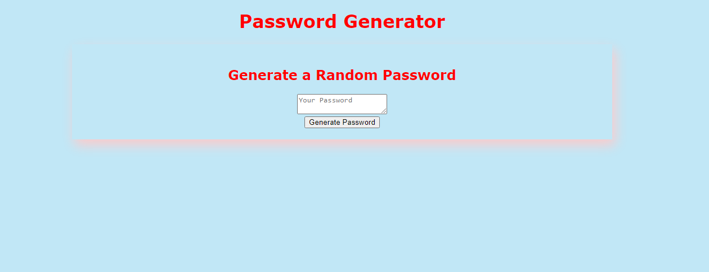
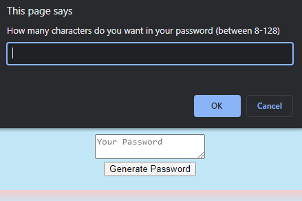
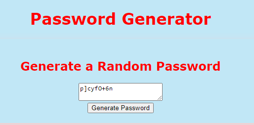

# 03 JavaScript: Password Generator - Module Challenge 3

## Description
The goal of this challenge is to create a password generator based on the number of characters input by the user. The password will be random and made up of the specific character set selected by users through a series of prompt menus. These characters will include "lowercase letters, uppercase letters, numbers and/or special characters".

## Screenshot

## Link
This [link](https://tyomoto.github.io/pizza-bacon/) will take you to deployed application on github pages.